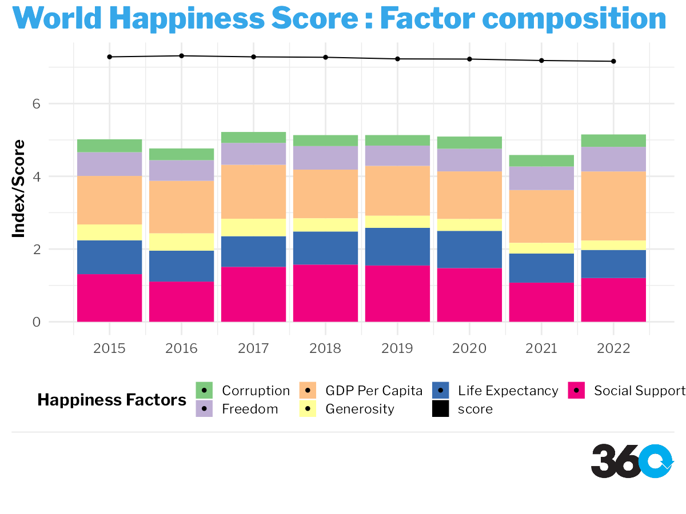

```{r, include = FALSE}
current_file <- knitr::current_input()
basename <- gsub(".Rmd$", "", current_file)

knitr::opts_chunk$set(
  fig.path = sprintf("images/%s/", basename),
  fig.width = 6,
  fig.height = 4,
  out.width = "100%",
  fig.align = "center",
  fig.retina = 3,
  echo = FALSE,
  warning = FALSE,
  message = FALSE,
  cache = FALSE,
  cache.path = "cache/"
)
```


```{r xaringan-themer, warning=FALSE, include=FALSE}
library(xaringanthemer)
library(xaringanExtra)
style_mono_light(
  base_color = "#23395b",
  header_font_google = google_font("Josefin Sans"),
  text_font_google   = google_font("Josefin Sans"),
  code_font_google   = google_font("Fira Mono")
)
```

```{r package, include=FALSE}

library(readr)
library(janitor)
library(tidyverse)
library(plotly)
library(stringr)
library(ggplot2)
library(sf)
library(rnaturalearthdata)
library(rnaturalearth)
library(ggpattern)
library(colorspace)
library(scales)
library(themes360info)

```


# Organisation: 360info

## Background

360info is an open access global information agency that addresses the world's biggest challenges and offers practical and research-based solutions.

### Role

Contribute to a Special Report made up of 5-10 articles looking at different aspects of, or solutions to, the problem in the following ways:

-   Exploratory Data Analysis
-   Data Wrangling support
-   Graphics

---

### Topic 1: Child Marriage during Covid-19
Due to Covid-19 about **9 million** more girls were at risk of child marriage.
.right-column[
```{r echo = FALSE, fig.align="center", warning=FALSE, message=FALSE, echo=FALSE, out.height="450px", out.width="680px"}

```

]
.left-column[
**Methodology**
* ggpattern package
* rnaturalearth package
* QGIS software

**Limitations:**
+ Latest Data for child marriage rate from 2005 - 2022.
+ Missing Data for many countries during Covid-19 period
]

---
### Topic 1: Child Marriage during Covid-19
```{r echo=FALSE, warning=FALSE, message= FALSE, out.height="375px", out.width="600px"}

child_marriage <- read_csv("data/child_marriage/child_marriage.csv")

child_covid <- child_marriage %>%
  clean_names()

child_covid <- child_covid %>%
  filter(time_period_time_period == 2021) %>%
  filter(!geographic_area %in% c("Fiji", "Denmark", "Singapore", "Least developed countries", "World"))

ggplot(data = child_covid, aes(
  y = reorder(geographic_area, obs_value_observation_value),
  x = obs_value_observation_value
)) +
  geom_bar(fill = "steelblue",
           stat = "identity") +
  geom_text(
    aes(label = obs_value_observation_value),
    hjust = 1.5,
    color = "black",
    size = 4
  ) +
  scale_y_discrete(labels = label_wrap(15)) +
  labs(title = paste("Child Marriage Rate in Sub Continental Region", "during Covid-19", sep ="\n"),
       caption = "UNICEF Data") +
  theme(axis.text.x = element_text(
    angle = 90,
    vjust = 0.5,
    hjust = 1,
  ),
  legend.position = "none") +
  xlab("Child Marriage Rate") +
  ylab("Region") +
  theme_minimal()

```

**Observations:**
+ In Eastern and Southern African countries like Ethiopia, Mozambique, Uganda, Congo and Zambia have the highest rate of child marriage.

+ Possible reasons: School closures, Economic Distress, Service Disruptions, Parental Deaths, Lack of access to basic ammenities.
*Source: UNICEF Press Release*


---

### Topic 2: The Economics of Well-Being: Can Money buy Happiness?😊

Progress of an economy cannot only be captured in terms of GDP, but should also be measured by metrics of health, education, and freedom.

```{r echo = FALSE, fig.align="center", warning=FALSE, message=FALSE, echo=FALSE, out.height="435px", out.width="625px"}



```

---

### Topic 2: The Economics of Well-Being

```{r echo = FALSE, fig.align="center", warning=FALSE, message=FALSE, echo=FALSE, out.height="425px", out.width="625px"}


```

**Observations**

💡 Nordic Countries like Finland, Sweden, Netherlands have highest happiness score
💡 Afghanistan has the lowest happiness score for 2022. Followed by other South Asian and African countries.
*Source: UNDP & World Happiness Report* 


---

class: center, middle

# Thank you for Watching!

```{r echo = FALSE, fig.align="center", warning=FALSE, message=FALSE, echo=FALSE, out.height="400px", out.width="500px"}


```


